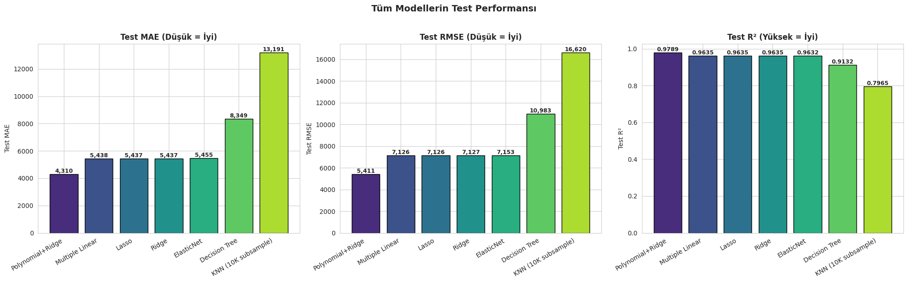
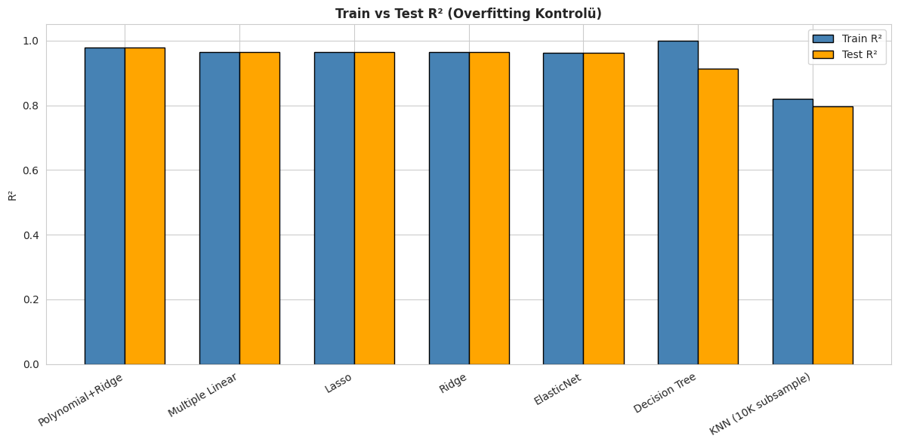
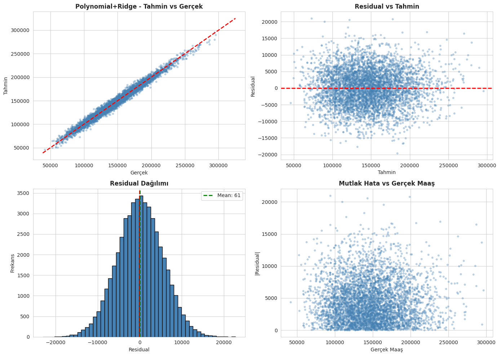
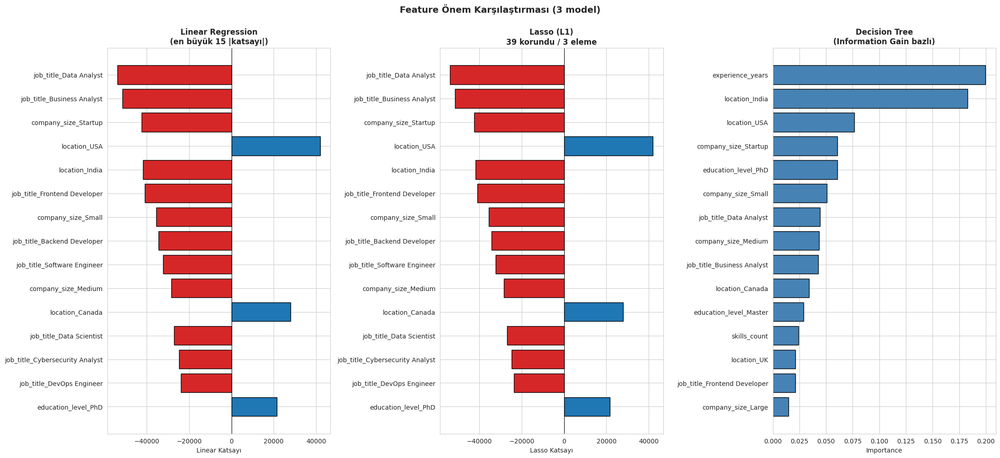
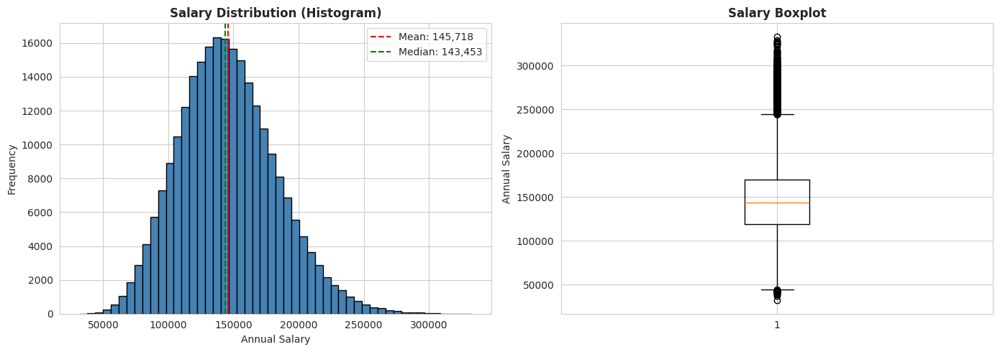

# Salary Prediction

Predicting annual salary from job-related features (experience, skills, role, location, company size, etc.). It's a regression problem on a publicly available Kaggle dataset, walked through end-to-end: EDA, preprocessing, a stack of regression models, and a comparison of how they perform.

## TL;DR

- 250,000 rows, 9 features, target is `salary` (USD).
- Models tried: Simple Linear, Multiple Linear, Ridge, Lasso, ElasticNet, Polynomial + Ridge, KNN, Decision Tree.
- Best result: **Polynomial(deg=2) + Ridge(α=1.0)** with **Test R² = 0.979** and **MAE ≈ $4.3K**.
- Multiple Linear Regression isn't far behind (R² = 0.964) and is much easier to interpret, so it's a good practical choice.
- Location, job title, company size, experience and education turn out to be the biggest drivers.

## Results at a glance

How all the models stack up on the test set:



Train vs. test R² for each model (Decision Tree clearly overfits, linear-family models generalize well):



Error analysis for the best model (Polynomial + Ridge):



What the model considers important — top features across Linear, Lasso, and Decision Tree:



Target distribution from EDA:



There are more figures in [`images/`](images/) — correlation heatmaps, the alpha sweep for Ridge/Lasso, the bias–variance curve for the polynomial degree, etc.

## Dataset

[Job Salary Prediction Dataset](https://www.kaggle.com/datasets/nalisha/job-salary-prediction-dataset) by `nalisha` on Kaggle (CC0). It's a semi-synthetic dataset, so the numbers are cleaner than real-world salary data would be — the absolute R² values reflect that. A copy of the CSV is committed under `data/raw/` so the pipeline runs without any extra downloads.

**Columns:**

| Type | Columns |
|---|---|
| Numeric | `experience_years`, `skills_count`, `certifications` |
| Categorical | `job_title` (12), `education_level` (5), `industry` (10), `company_size` (5), `location` (10), `remote_work` (3) |
| Target | `salary` (annual, USD) |

No missing values, no duplicates.

## Method

A standard regression pipeline:

1. **Split** into train / val / test (60 / 20 / 20, `random_state=42`).
2. **Preprocess** with a `ColumnTransformer`:
   - `StandardScaler` for numeric columns
   - `OneHotEncoder(drop='first', handle_unknown='ignore')` for categorical columns
   - Fit on train only — val and test are only transformed, to avoid leakage.
3. **Train a series of models** and compare them with MAE / RMSE / R² plus 5-fold cross-validation:
   - Simple Linear Regression (baseline)
   - Multiple Linear Regression
   - Ridge, Lasso, ElasticNet (alpha sweep)
   - Polynomial features (degree 2 and 3) + Ridge
   - K-Nearest Neighbors
   - Decision Tree
4. **Interpret** the best linear model (coefficients), Lasso's feature elimination, and Decision Tree's feature importance.

The two slowest steps (`06_polynomial.py` and `07_knn_tree.py`) take most of the wall time — the rest finish in seconds.

## Setup and running

Requires Python 3.10+.

```bash
git clone https://github.com/Kuipyy/salary-prediction.git
cd salary-prediction

python3 -m venv .venv
source .venv/bin/activate          # Windows: .venv\Scripts\activate
pip install -r requirements.txt
```

Then run the scripts in order from the repo root (each one writes its outputs to `outputs/` and `data/processed/`):

```bash
python src/01_eda.py
python src/02_feature_analysis.py
python src/03_preprocessing.py
python src/04_linear_models.py
python src/05_regularization.py
python src/06_polynomial.py
python src/07_knn_tree.py
python src/08_evaluation.py
python src/09_interpretability.py
```

Or in one go:

```bash
for s in src/0*.py; do python "$s"; done
```

Total runtime is around 15–25 minutes on a regular laptop — almost all of it spent in the polynomial and KNN steps. The figures land in `outputs/figures/`, trained models and result tables in `outputs/models/`.

## Project layout

```
salary-prediction/
├── data/
│   └── raw/job_salary_prediction_dataset.csv   # source data
├── images/                                     # precomputed result figures used in this README
├── src/
│   ├── 01_eda.py                # exploratory data analysis
│   ├── 02_feature_analysis.py   # correlations, multicollinearity
│   ├── 03_preprocessing.py      # split + encode + scale
│   ├── 04_linear_models.py      # Simple + Multiple Linear
│   ├── 05_regularization.py     # Ridge, Lasso, ElasticNet
│   ├── 06_polynomial.py         # Polynomial + Ridge, bias–variance
│   ├── 07_knn_tree.py           # KNN + Decision Tree
│   ├── 08_evaluation.py         # cross-model comparison
│   └── 09_interpretability.py   # feature importance
├── requirements.txt
└── README.md
```

`outputs/` and `data/processed/` are gitignored — they're produced by the pipeline.

## Notes and caveats

- The dataset is semi-synthetic, so the very high R² (0.98) shouldn't be read as "salaries are this predictable in real life." On real data — Glassdoor / PayScale style — you'd expect something more like 0.6–0.8.
- Decision Tree gets a near-perfect R² on training but drops to ~0.91 on test — classic overfitting. Don't use it unconstrained; pruning or an ensemble would help.
- Location is one of the strongest predictors. If this were going into anything user-facing, it would need a fairness review, because raw country features can encode cost-of-living and labor-market biases at the same time.
